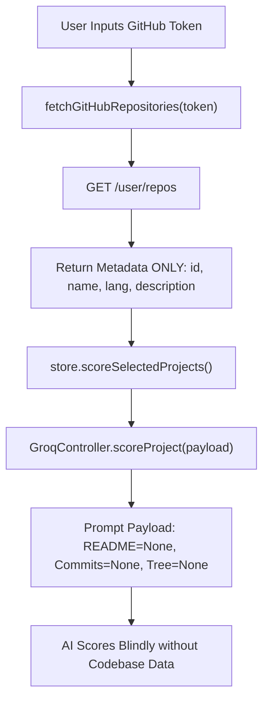
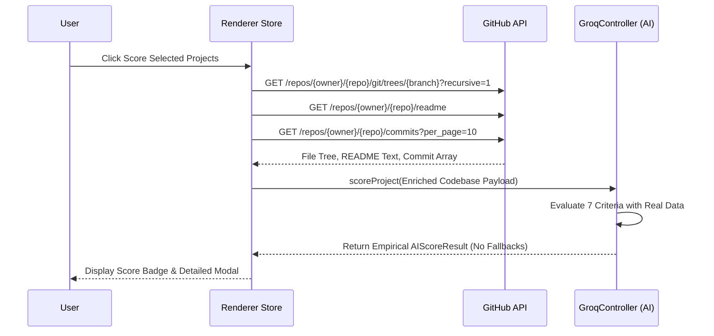

# Audit & Performance Plan: GitHub Codebase Inspection & AI Scoring

**Feature**: Project Score Visual & Improvement Tips (`014-project-score-breakdown`)
**Date**: 2026-09-19
**Author**: Currynator AI Agent

---

## 1. Executive Summary

An audit of the current Projects view workflow reveals that while GitHub Personal Access Tokens are successfully used to fetch a list of user repositories, **zero codebase content (README, commit logs, file tree, or source code) is currently extracted or forwarded to the AI scoring engine**.

As a result, `GroqController.scoreProject` receives `None` for all empirical criteria, forcing the AI model to evaluate project quality solely on the repository name and short description.

This document outlines the investigation findings, performance and token economy optimizations, zero-fallback policy enforcement, and an actionable list of improvements to provide deep codebase inspection for AI scoring.

---

## 2. Current Workflow & Gap Analysis

### Identified Gaps

1. **Shallow Data Ingestion**: `fetchGitHubRepositories()` calls `GET /user/repos`, which only returns metadata (repo name, description, star count, primary language). No source code or tree data is retrieved.
2. **Empty Prompt Payload**: `useProjectsStore.ts` constructs payloads with `id`, `name`, `description`, `language`, `html_url`, omitting `readmeContent`, `commitLogs`, and `fileTree`.
3. **Impaired AI Audit Accuracy**: `GroqController.ts` attempts to score 7 distinct criteria:
   - `readme_structure` (Requires `README.md` content)
   - `real_demo` (Requires demo URLs / badges in README or repo metadata)
   - `commit_history` (Requires recent commit messages)
   - `codebase_structure` (Requires directory & file tree structure)
   - `language_best_practices` (Requires file tree & configuration files)
   - `no_debug_artifacts` (Requires code sampling)
   - `test_coverage` (Requires test file detection in file tree)
   Because payload fields are missing, the AI model has no empirical evidence to audit.

---

## 3. GitHub Codebase Access Mechanisms & Benchmark

We investigated four mechanisms to grant the system access to user codebases via GitHub PAT:

| Access Mechanism | API Method | Latency per Repo | Token Cost (AI Prompt) | Rate Limit Impact | Assessment |
|---|---|---|---|---|---|
| **A. Repo Tarball/Zip Download** | `GET /repos/{owner}/{repo}/zipball` | High (1-3s download + unpack) | Extremely High (>50,000 tokens) | High bandwidth | **Rejected** (Wasteful token economy, slow) |
| **B. GraphQL API Query** | `POST https://api.github.com/graphql` | Low (150-300ms, 1 request) | Medium (~3,000 tokens) | 1 GraphQL point | **Recommended for Single-Call Bulk Fetch** |
| **C. Git Recursive Tree + REST Endpoints** | `GET /git/trees/{branch}?recursive=1` + `GET /readme` + `GET /commits` | Fast (200-400ms across 3 async GETs) | Optimal (~1,500 - 2,000 tokens) | 3 REST requests | **Recommended (Universal REST support)** |
| **D. Shallow Metadata Only (Current)** | `GET /user/repos` | Fast (100ms) | Low (~200 tokens) | 1 REST request | **Rejected** (No codebase access) |

---

## 4. Token Economy & Performance Architecture

To achieve **maximum evaluation accuracy** while staying within strict **token budget constraints and fast response times**, we establish a targeted sampling strategy:

### A. Context Budgeting Breakdown per Repository

| Inspection Artifact | Extraction Method | Max Tokens | Purpose |
|---|---|---|---|
| **Repository Metadata** | `GET /repos/{owner}/{repo}` | ~100 tokens | Basic info, default branch, homepage/demo URL |
| **File Tree Structure** | `GET /repos/{owner}/{repo}/git/trees/{branch}?recursive=1` | ~500 tokens | Evaluates `codebase_structure`, `test_coverage` (e.g. `*.test.ts`, `jest.config`), and project layout |
| **README Content** | `GET /repos/{owner}/{repo}/readme` | ~600 tokens (Truncated to 2,000 chars) | Evaluates `readme_structure` and `real_demo` links |
| **Recent Commit History** | `GET /repos/{owner}/{repo}/commits?per_page=10` | ~300 tokens (10 commit messages) | Evaluates `commit_history` quality and conventions |
| **Key Config & Source Sample** | Fetch `package.json` / `tsconfig.json` | ~300 tokens | Evaluates `language_best_practices` & dependencies |
| **Total Prompt Size** | | **~1,800 tokens** | **Fits comfortably within Groq `qwen/qwen3.8-27b` context window with minimal latency** |

### B. Parallel Execution Flow

---

## 5. Strict Zero-Fallback Policy

Per user directive: **No fallback scores are allowed for this operation.**

1. **No Dummy/Default Scores**: If a project cannot be inspected due to private repo access restrictions, missing scopes, or GitHub API rate limits, the system MUST NOT return a fake fallback score (e.g. 50/100).
2. **Explicit Error Handling**: If codebase fetching fails:
   - Return `success: false` with explicit error detail (e.g., `"GitHub API error (404/403): Token lacks 'repo' scope for private repository inspection."`).
   - Display a clear error banner in the Projects View explaining required token permissions.
3. **Permission Requirements**:
   - For **public repositories**: Standard GitHub Personal Access Token (or unauthenticated fallback with rate limit warning).
   - For **private repositories**: Personal Access Token with `repo` scope enabled.

---

## 6. Actionable List of Improvements

### Phase 1: GitHub Codebase Inspection Service (`src/renderer/src/features/projects/utils/githubService.ts`)
- [ ] **IMP-01**: Implement `fetchProjectCodebaseDetails(token, owner, repo, defaultBranch)` to fetch:
  - Repository README (`GET /repos/{owner}/{repo}/readme` using `Accept: application/vnd.github.raw`)
  - Recent Commit History (`GET /repos/{owner}/{repo}/commits?per_page=10`)
  - Complete File Tree (`GET /repos/{owner}/{repo}/git/trees/{defaultBranch || 'main'}?recursive=1`)
- [ ] **IMP-02**: Filter and format the file tree into a concise path summary (max 50 key file paths prioritizing config files, test files, source files, and docs).

### Phase 2: Enriched Store Scoring Payload (`src/renderer/src/features/projects/store/useProjectsStore.ts`)
- [ ] **IMP-03**: Update `scoreSingleProject` to call `fetchProjectCodebaseDetails` before dispatching payload to `GroqController`.
- [ ] **IMP-04**: Construct enriched payload containing `readmeContent`, `commitLogs`, and `fileTree`.
- [ ] **IMP-05**: Enforce zero-fallback error propagation—if `fetchProjectCodebaseDetails` fails, mark repository evaluation as failed with exact GitHub error message.

### Phase 3: AI Prompt & Parser Calibration (`src/main/controllers/GroqController.ts`)
- [ ] **IMP-06**: Calibrate `GroqController.scoreProject` prompt to analyze the populated `readmeContent`, `commitLogs`, and `fileTree` strings.
- [ ] **IMP-07**: Ensure category scores and improvement tips directly cite actual files and commit patterns detected in the payload.

### Phase 4: Verification & UI Error Feedback (`src/renderer/src/features/projects/components/ProjectsView.tsx`)
- [ ] **IMP-08**: Add explicit token scope guidance in `TokenSetupView` reminding users that `repo` scope is required for private project codebase scoring.
- [ ] **IMP-09**: Write end-to-end integration unit tests in `src/renderer/src/features/projects/tests/` verifying codebase payload enrichment and error handling.
