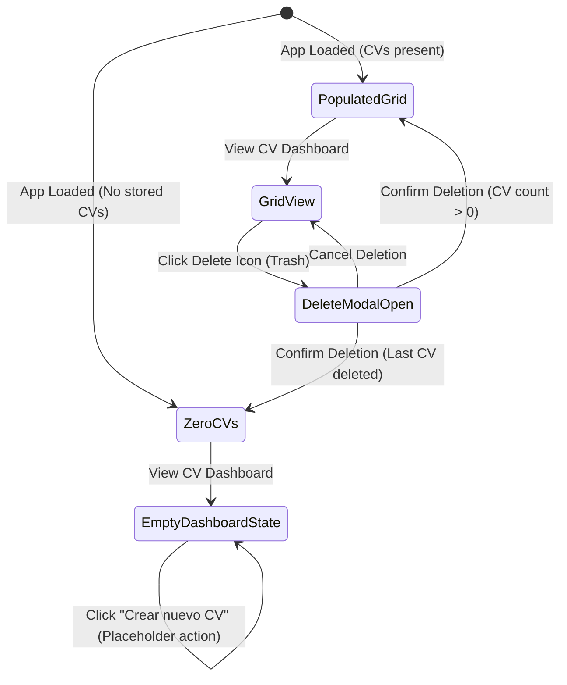

# Data Model: CV Dashboard View

## Entities

### `ApplicationCv`

Represents an application-focused CV item tailored for a specific vacancy.

#### Fields

| Field Name | Type | Validation Rules | Description |
|---|---|---|---|
| `id` | `string` | UUID / non-empty string | Unique identifier for the custom CV. |
| `targetVacancyTitle` | `string` | Required, non-empty, max 120 chars | Title of the targeted job position or vacancy. |
| `jobDescriptionSnippet` | `string` | Required, non-empty | Snippet/summary of the job description. |
| `createdAt` | `string` | ISO 8601 Date string | Timestamp when the custom CV was created. |
| `updatedAt` | `string` | ISO 8601 Date string | Timestamp when the custom CV was last updated. |

#### Zod Validation Schema

```typescript
import { z } from 'zod';

export const ApplicationCvSchema = z.object({
  id: z.string().min(1, 'ID is required'),
  targetVacancyTitle: z.string().min(1, 'Target vacancy title is required').max(120),
  jobDescriptionSnippet: z.string().min(1, 'Job description snippet is required'),
  createdAt: z.string().datetime({ message: 'Invalid ISO date for createdAt' }),
  updatedAt: z.string().datetime({ message: 'Invalid ISO date for updatedAt' }),
});

export type ApplicationCv = z.infer<typeof ApplicationCvSchema>;
```

## Dashboard State Schema

```typescript
export interface CvDashboardState {
  cvItems: ApplicationCv[];
  activeView: 'home' | 'cv-dashboard';
  deletingCvId: string | null;
  setActiveView: (view: 'home' | 'cv-dashboard') => void;
  deleteCv: (id: string) => void;
  setDeletingCvId: (id: string | null) => void;
}
```

## State Transitions


