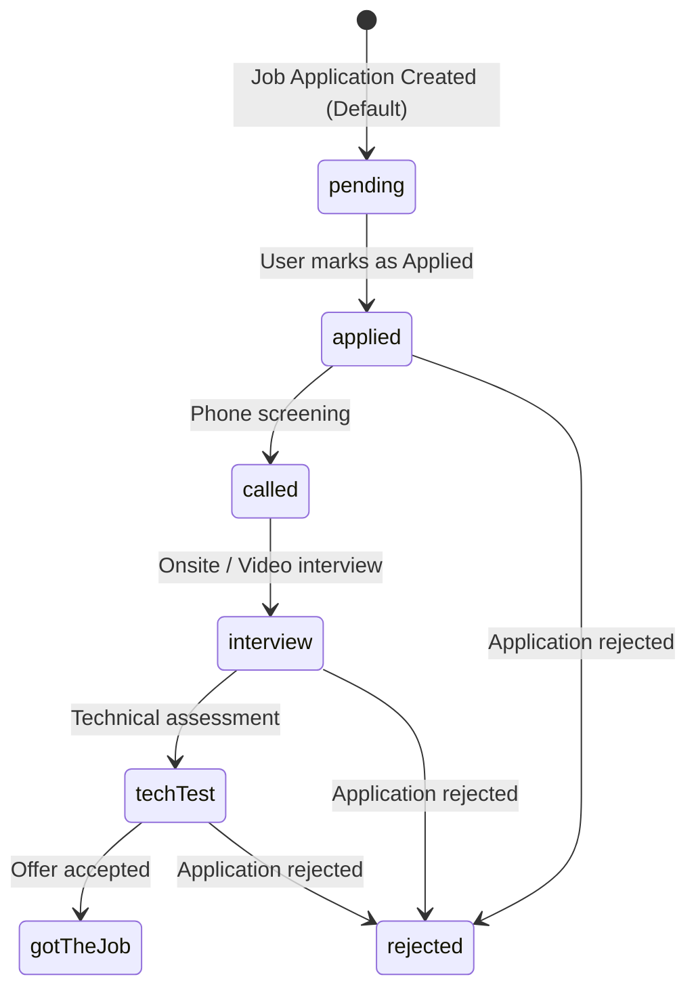
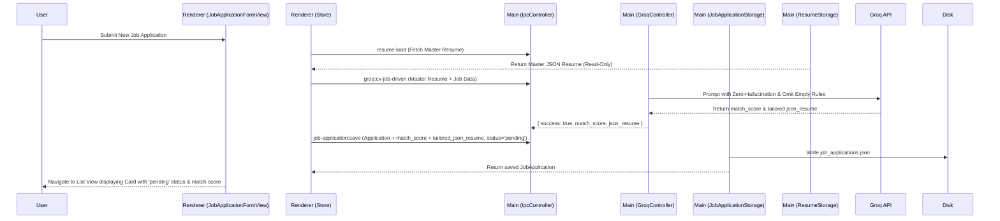

# Phase 1 Data Model: CV Job Application - CV Generator

**Feature**: `009-cv-job-generator`

## 1. Updated Schemas & Entities

### JobApplication Schema Update (`jobApplicationSchema.ts`)

```typescript
import { z } from 'zod';

export const JobApplicationStatusSchema = z.enum([
  'pending',
  'applied',
  'called',
  'interview',
  'techTest',
  'rejected',
  'gotTheJob',
]);

export const JobApplicationSchema = z.object({
  id: z.string().min(1, 'ID is required'),
  title: z.string().min(1, 'Title is required'),
  jobDescription: z.string().min(1, 'Job description is required'),
  companyDescription: z.string().optional().default(''),
  jobRequirement: z.string().min(1, 'Job requirements are required'),
  companyWebsiteUrl: z.string().optional().default(''),
  created_at: z.string(),
  updated_at: z.string(),
  status: JobApplicationStatusSchema.default('pending'),
  match_score: z.number().min(0).max(100).optional(),
  tailored_json_resume: z.record(z.any()).optional(),
});

export const JobApplicationListSchema = z.array(JobApplicationSchema);

export type JobApplicationStatus = z.infer<typeof JobApplicationStatusSchema>;
export type JobApplication = z.infer<typeof JobApplicationSchema>;
```

### Groq Job Driven Response Payload Type

```typescript
export interface GroqCvJobDrivenResponse {
  success: boolean;
  match_score?: number;
  json_resume?: Record<string, any>;
  error?: string;
}
```

---

## 2. State Transitions



---

## 3. Data Flow


