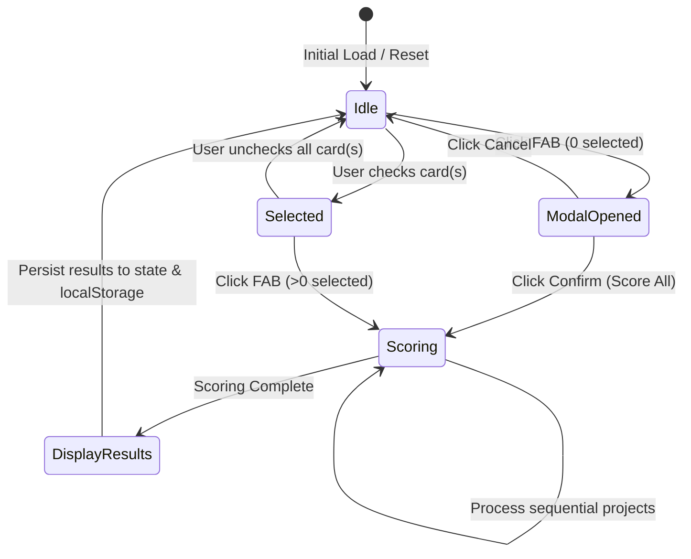

# Data Model: AI Score Projects

## 1. Entities & Types

### ProjectSelectionState (Renderer Store)
- `selectedRepoIds`: `number[]` - Array of selected GitHub repository IDs.
- `isConfirmModalOpen`: `boolean` - Modal open state when 0 projects are selected and FAB is clicked.
- `isScoring`: `boolean` - Indicates whether AI scoring is actively processing.
- `scoringProgress`: `{ current: number; total: number } | null` - Progress tracking for batch/sequential scoring.

---

### ProjectScoreCategory (Enum / Const Union)
- `'readme_structure'`: Structure and completeness of `README.md`.
- `'real_demo'`: Presence of live demo, deployment URL, or video/preview links.
- `'commit_history'`: Cleanliness and clarity of git commit messages.
- `'codebase_structure'`: Directory organization and pattern consistency.
- `'language_best_practices'`: Naming conventions and language guidelines.
- `'no_debug_artifacts'`: Absence of leftover `console.log()` or debug statements.
- `'test_coverage'`: Presence and structure of unit or integration tests.

---

### ScoreLogItem
- `category`: `ProjectScoreCategory` - The evaluation category.
- `title`: `string` - Human readable category title.
- `score`: `number` - Score out of 100 for this specific category.
- `log`: `string` - Explanation/justification log from AI evaluation.
- `improvements`: `string[]` - List of bullet point improvement suggestions for this category.

---

### AIScoreResult
- `repoId`: `number` - The GitHub repository ID evaluated.
- `repoName`: `string` - Name of the repository.
- `totalScore`: `number` - Integer score from 1 to 100.
- `evaluatedAt`: `string` - ISO timestamp when evaluation occurred.
- `logs`: `ScoreLogItem[]` - Breakdown logs and improvement lists for all 7 evaluated criteria.

---

### GroqScoreRequestPayload
- `repoId`: `number`
- `name`: `string`
- `description`: `string | null`
- `language`: `string | null`
- `html_url`: `string`
- `readmeContent`?: `string`
- `commitLogs`?: `string[]`
- `fileTree`?: `string[]`

---

## 2. Relationships & State Transitions

